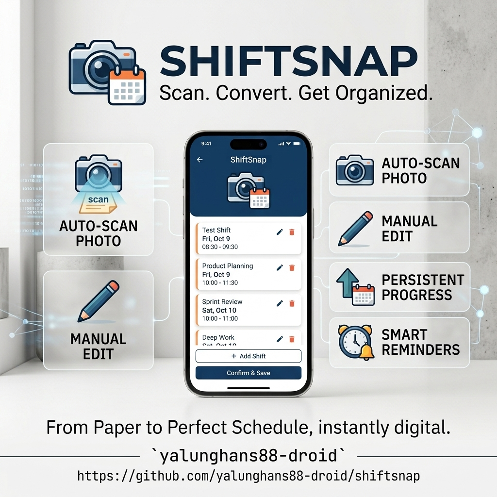
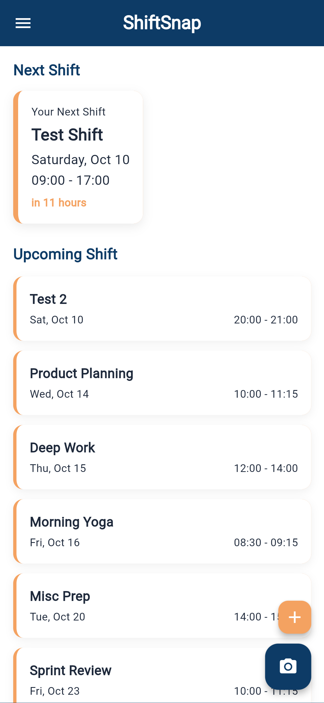
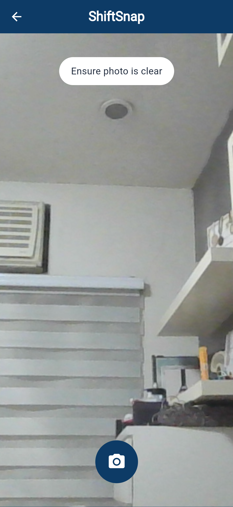
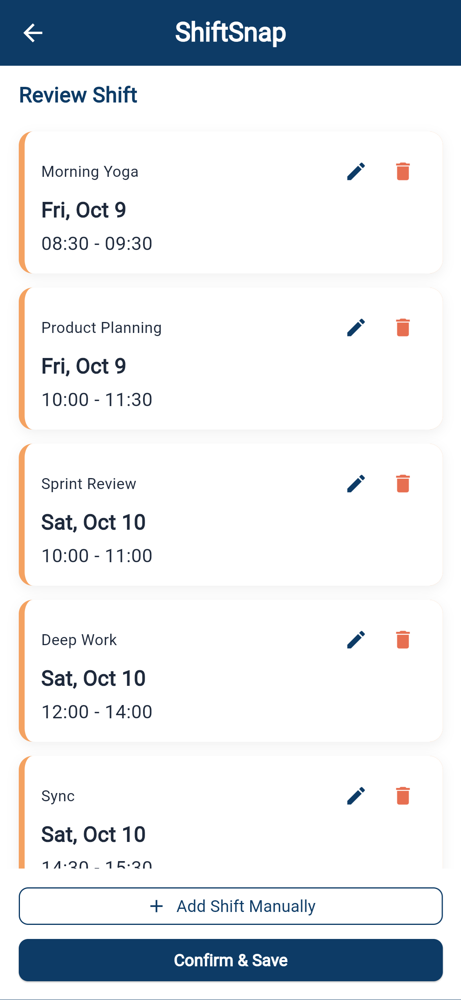
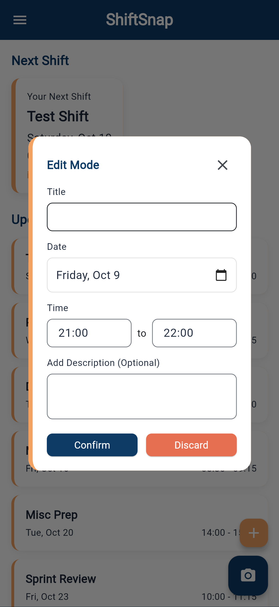

# ShiftSnap

*A mobile shift scheduler that turns a photo of a printed duty roster into a reminder-filled calendar.*

**Live demo:** https://yalunghans88-droid.github.io/shiftsnap/

**Demo video:** **Demo video:** [Watch the demo](https://drive.google.com/drive/folders/160WKw60N_iAsPOwgPwXkRfF8L1Rg3Gge?usp=sharing)

**Presentation slides:** [View the slides](docs/presentation.pdf)

**Square image:** 

**Course:** Applications Development and Emerging Technologies

**Author:** [yalunghans88-droid](https://github.com/yalunghans88-droid)

---

## Screenshots

Captured from the current Flutter build at a phone-sized viewport.

### The four screens

| Home | Camera |
| --- | --- |
|  |  |

| Review | Manual edit |
| --- | --- |
|  |  |

Additional screenshots: `docs/assets/screen-home-expanded-shift.png`, `docs/assets/screen-settings.png`.

## What it does

- **Reads a printed duty roster from a photo.** The user photographs the roster, and Google Gemini extracts every shift (title, date, start time, end time) into structured data.
- **Extracts into an editable list, not a fixed answer.** Every extracted shift appears as a card that can be edited, deleted, or have its description added before saving.
- **Adds shifts manually when needed.** Users who don't want to use the camera — or when Gemini misses a shift — can add one by hand from the Home screen or the Review screen.
- **Persists shifts locally.** All shifts, roster history, and reminder preferences are stored on the device with Hive. There is no backend and no user account.
- **Reminds before each shift.** The user picks a reminder lead time (15 / 30 / 60 / 120 / 240 minutes) and the app schedules a local notification before each confirmed shift.
- **Shows the next shift at a glance.** The Home screen highlights the next upcoming shift in a hero card with a live countdown ("in 2 hours"), followed by a list of what's next.
- **Guards against bad AI output.** If Gemini returns a date in the past, the app silently rolls the year forward so the shift still appears. If the API is unreachable, it fails cleanly with an error message instead of crashing.

## Built with

| | |
| --- | --- |
| Framework | Flutter (Dart), Material 3 |
| State | Riverpod 3.0 (`Notifier` + `NotifierProvider`) |
| Storage | Hive CE (community fork of Hive) |
| AI | `google_generative_ai` — Gemini extracts shifts from roster photos |
| Camera | `camera` package — live preview with overlay |
| Notifications | `flutter_local_notifications` + `timezone` |
| Config | `flutter_dotenv` — loads `GEMINI_API_KEY` from a gitignored `.env` file |

## Running it yourself

```bash
git clone https://github.com/yalunghans88-droid/shiftsnap.git
cd shiftsnap
flutter pub get
dart run build_runner build --delete-conflicting-outputs
flutter run

Verified with Flutter 3.47.5 (stable). Android SDK and an Android device or emulator are needed for the full camera flow — the camera package does not work in a browser.

Optional: UI-only preview on web

flutter run -d chrome --web-port=5000

The app renders, but the camera screen shows "No camera available on this device." To test the full capture → extract → review flow, run on Android or iOS.

Environment variables
This project reads its Gemini API key from a .env file that is not in the repository. Create it locally:
# In the project root:
echo "GEMINI_API_KEY=your_api_key_here" > .env

Then verify Git ignores it:
git check-ignore .env    # should print ".env"

Get an API key at https://aistudio.google.com/app/apikey. Never commit the real key.

Variable	What it is	Where to get one
GEMINI_API_KEY	Google Gemini API key, used to extract shifts from roster photos	https://aistudio.google.com/app/apikey
If the key is missing or the API call fails, the app shows a friendly error and the user can fall back to adding shifts manually.

Privacy and secrets
The current build is local-first. Shifts, roster history, and reminder preferences live on the device inside a Hive database and are never sent to a server. There is no user account, no analytics, and no cloud sync.

The Gemini integration reads its API key from .env locally and the file is gitignored. Roster photos are sent to the Gemini API only when the user explicitly taps the shutter, and no photos are stored on any server — extraction is stateless.

All sample data, screenshots, and the demo video contain no real personal information. The roster photos used for testing were printed documents with fictional names.

lib/
├── main.dart                          # app entry, Hive init, Riverpod scope
├── models/
│   ├── shift.dart                     # Shift entity (title, date, times, confirmed)
│   ├── scanned_roster.dart            # Roster metadata (image path, date scanned)
│   └── user_preferences.dart          # Reminder settings
├── providers/
│   ├── shift_provider.dart            # reactive shift list + version bump
│   ├── roster_provider.dart           # in-progress extraction state
│   └── preferences_provider.dart      # reminder preference
├── screens/
│   ├── home_screen.dart               # hero card + upcoming shifts + FABs
│   ├── camera_screen.dart             # viewfinder + shutter
│   └── review_screen.dart             # extracted shifts + edit/delete + save
├── services/
│   ├── gemini_service.dart            # Gemini API calls + JSON parsing
│   ├── storage_service.dart           # Hive box wrappers
│   └── notification_service.dart      # local shift reminders
├── widgets/
│   ├── app_bar.dart                   # global Deep Navy app bar
│   ├── shift_card.dart                # hero + standard card variants
│   ├── edit_modal.dart                # pop-up edit form
│   ├── empty_state.dart               # "Capture your first Snap now"
│   └── settings_drawer.dart           # hamburger drawer with reminder settings
└── theme/
    ├── colors.dart                    # Deep Navy, Warm Amber, etc.
    └── text_styles.dart               # type scale

    Known issues and next steps
Android build requires SDK setup. The camera flow runs on real Android devices but requires Java, the Android SDK command-line tools, and the NDK licenses accepted. Setup is documented but not automated.

Gemini sometimes returns wrong years. Mitigated by a _forceFutureYear helper that advances past dates forward, but the prompt could still be tightened with few-shot examples.

No cloud sync. All data is device-local. A shift added on one phone doesn't appear on another.

Notifications are untested on iOS. The Android schedule path works; iOS background restrictions may require additional setup.

No calendar export yet. Shifts can be added inside the app but not synced to the device's native calendar.

Editing time is free-text. The start and end time fields accept "HH:mm" as a string. A proper time picker would reduce user error.

Next: a calendar export, iOS permission strings, a home-screen widget showing the next shift, and a small onboarding flow for first-time users.

## Project documentation

| Document | |
| --- | --- |
| [Proposal](docs/proposal.pdf) | the problem, users, scope, and storage decision |
| [Mockup and wireframes](docs/mockup.pdf) | what each screen looks like |
| [Design system](docs/design-system.pdf) | palette, type, spacing, components |
| [Security and privacy](SECURITY-CHECKLIST.md) | repository security state |
| [AI usage](AI-USAGE.md) | how AI was used, and where it went wrong |
| [Presentation slides](docs/presentation.pdf) | course presentation deck |
| [Screenshots](docs/assets/) | app screenshots at phone size |

Assistant used: Claude (Anthropic) for architecture discussion, debugging, and documentation structure. A significant part of the scaffolding was AI-assisted — the initial widget structure, the theme files, and the first pass at each screen. I wrote and adjusted the logic that matters: the shift reactivity pattern (manual version-bump because box.watch() is unreliable on Android), the _forceFutureYear guard against Gemini's date guessing, the state management migration to Riverpod 3.0, and the future-date filtering that powers the "Next Shift" hero card.

Full account in AI-USAGE.md.

## Licence

MIT, see [LICENSE](LICENSE).